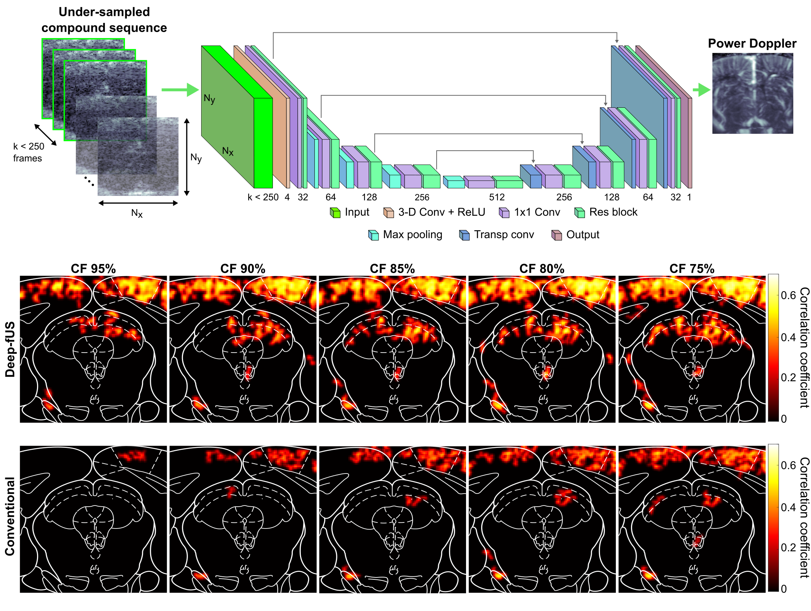

# Deep-fUS: A deep learning platform for functional ultrasound imaging of the brain using sparse data



## Description

This repository contains the software to reconstruct power Doppler images for functional ultrasound using sparse compound datasets.

Functional ultrasound (fUS) is a rapidly emerging modality that enables whole-brain imaging of neural activity in awake and mobile rodents. To achieve sufficient blood flow sensitivity in the brain microvasculature, fUS relies on long ultrasound data acquisitions at high frame rates, posing high demands on the sampling and processing hardware. We developed an end-to-end image reconstruction approach based on deep learning that significantly reduces the amount of data necessary while retaining the imaging performance. We trained convolutional neural networks to learn the power Doppler reconstruction function from sparse sequences of ultrasound data with a compression factor of up to 95%.

The code in this repository has been tested with Python 3.7.7 using TensorFlow Keras version 2.1.0.

For a more detailed description of the objectives and the methods developed in this work, please refer to the paper cited below.

## Networks
We modified a U-Net by adding an input layer of 4 3-D convolutional filters followed by ReLU activations. The size of the filter kernels was considered as a hyperparameter and was optimized via Bayesian optimization (see below). In addition, we replaced the convolutional layers with residual blocks composed of two cascaded Conv/ReLU/Dropout layers and included shortcut connections between the input and output features. Residual blocks were arranged in a 5-layer encoder followed by a 4-layer decoder path, and implement 3×3 convolutions followed by ReLU activations and a dropout layer to improve regularization. The dropout rate was considered as a hyperparameter and optimized via Bayesian optimization (see below). We used 1×1 convolutions at the input of each layer to equalize the number of input and output features of each residual block. In the encoder path, down-sampling is performed by a 2×2 max pooling operator that halves the resolution in both the image dimensions. In the decoder path, 2×2 transposed convolutions with ReLU activations are used as up-sampling operators. The number of channels is progressively increased in the encoder path (32, 64, 128, 256, and 256 filters) and then decreased in the decoder (256, 128, 64, and 32 filters). The output layer is a single-channel 1×1 convolution block. The stride is equal to 1 in all the convolutional layers and 2 in the max pooling and transposed convolution blocks. All the convolutional kernels are initialized using the He initialization. This network is referred to as ResUNet53D in [src/models.py](src/models.py).

In [src/models.py](src/models.py) you will also find additional networks that we trained to compare the imaging performance of the ResUNet above, including a network that performs the post-processing of power Doppler images that were generated by conventional processing of sparse compound sequences (UNet5_postproc in [src/models.py](src/models.py)).


## Datasets
Training, validation, and testing datasets are made of pairs of compound data frames (x) and respective power Doppler images (y). An image size of 96×96 pixels is assumed. All the scripts in this repository assume that the data are provided in .mat format.

You can download a sample test set [here](https://drive.google.com/drive/folders/1Mwfe8xrd0S8Y8RHcGhajvET-U_om4Wur?usp=drive_link).

We have not yet made training and validation sets publicly available. If you wish to retrain the models using your own data, training and validation sets should be added to the folders [data/train](data/train) and [data/dev](data/dev). 


## Network training, optimization, and testing

### Bayesian hyperparameter search
In addition to the hyperparameters above, we considered the learning rate and the loss weight λ as hyperparameters. We optimized the network's hyperparameters using the Bayesian optimization routine in Keras Tuner. 

In the `src` folder, call `python hp_search.py` to execute the [optimization routine](src/hp_search.py). The routine executes 15 optimization trials (each trial trains the network for 2500 epochs) and returns the model that maximizes the validation SSIM. Note that this routine assumes that the training and validation datasets are available in the folders [data/train](data/train) and [data/dev](data/dev).

### Training the neural network
If you would rather test your own set of hyperparameters, you can call `python train.py` in the `src` folder. Currently, the [training routine](src/train.py) uses the hyperparameters values from our Bayesian optimization. Note that this routine assumes that the training and validation datasets are available in the folders [data/train](data/train) and [data/dev](data/dev).


### Reconstructing test images using a pre-trained model
Pre-trained models are available in [pretrained_models](pretrained_models). Use one of these models to reconstruct the power Doppler images in the folder [data/test](data/test).

In the `src` folder, call `python predict.py` to reconstruct the images in the test set. This script plots the images reconstructed by the network (predicted), the reference images (original) reconstructed by the conventional power Doppler processing with the full compound dataset, the absolute difference images, and the scatter plots of the pixel values in the predicted and original images. In addition, the script saves the .mat files and the quantitative metrics (SSIM, PSNR, and NMSE) for each image. The results are saved in the model folder.


## Final notes
This repository is a work in progress, and I try my best to keep it up to date with the most recent models that I test. 

Please don't hesitate to [contact me](mailto:todiian@stanford.edu) with suggestions, recommendations, or feedback on this work!


## Software License
Copyright 2021 Tommaso Di Ianni

Licensed under the Apache License, Version 2.0 (the "License");
you may not use this file except in compliance with the License.
You may obtain a copy of the License at

    http://www.apache.org/licenses/LICENSE-2.0

Unless required by applicable law or agreed to in writing, software
distributed under the License is distributed on an "AS IS" BASIS,
WITHOUT WARRANTIES OR CONDITIONS OF ANY KIND, either express or implied.
See the License for the specific language governing permissions and
limitations under the License.

## Citing this work

```
@ARTICLE{9701931,
  author={Di Ianni, Tommaso and Airan, Raag D.},
  journal={IEEE Transactions on Medical Imaging}, 
  title={Deep-fUS: A deep learning platform for functional ultrasound imaging of the brain using sparse data}, 
  year={2022},
  volume={},
  number={},
  pages={1-1},
  doi={10.1109/TMI.2022.3148728}
  }
```

