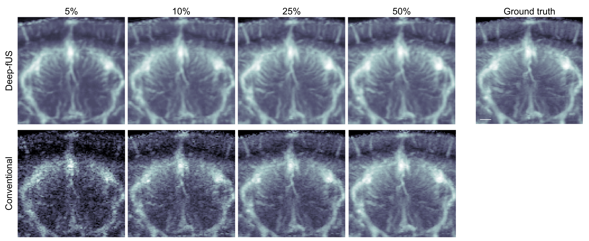

# Deep-fUS: functional ultrasound imaging of the brain using deep learning and sparse data


## Description
This repository contains the software for reconstruction of power Doppler images from sparse compound ultrasound datasets.

The code has been tested with Python 3.7.7 using TensorFlow Keras version 2.1.0.

Training this model on an NVIDIA TITAN RTX GPU took approximately 13 sec per epoch.


### Datasets

### Training the neural network
To train the model, execute [src/test_training.py](src/test_training.py). The script calls the function [src/train.py](src/train.py) and assumes that the training and validation examples are in the [datasets/train](datasets/train) and [datasets/dev](datasets/dev) folders, respectively.

### Predicting the test set using a pre-trained model
To predict the fUS images in the test set using one of the pre-trained models in [pretrained_models](pretrained_models), execute [src/predict.py](src/predict.py). This script assumes that the test examples are in the [datasets/test](datasets/test) folder.

## Software License

Copyright 2020 Tommaso Di Ianni

Licensed under the Apache License, Version 2.0 (the "License");
you may not use this file except in compliance with the License.
You may obtain a copy of the License at

    http://www.apache.org/licenses/LICENSE-2.0

Unless required by applicable law or agreed to in writing, software
distributed under the License is distributed on an "AS IS" BASIS,
WITHOUT WARRANTIES OR CONDITIONS OF ANY KIND, either express or implied.
See the License for the specific language governing permissions and
limitations under the License.

## Citing this work

```
@article {Di Ianni2020.09.29.319368,
author = {Di Ianni, Tommaso and Airan, Raag D.},
title = {Deep-fUS: functional ultrasound imaging of the brain using deep learning and sparse data},
elocation-id = {2020.09.29.319368},
year = {2020},
doi = {10.1101/2020.09.29.319368},
publisher = {Cold Spring Harbor Laboratory},
URL = {https://www.biorxiv.org/content/early/2020/10/01/2020.09.29.319368},
eprint = {https://www.biorxiv.org/content/early/2020/10/01/2020.09.29.319368.full.pdf},
journal = {bioRxiv}
}
```

